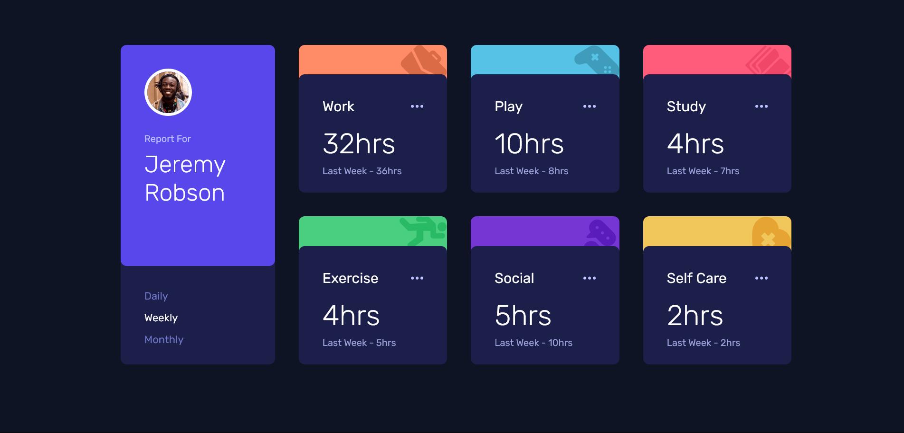

# Frontend Mentor - Time tracking dashboard solution

This is a solution to the [Time tracking dashboard challenge on Frontend Mentor](https://www.frontendmentor.io/challenges/time-tracking-dashboard-UIQ7167Jw). Frontend Mentor challenges help you improve your coding skills by building realistic projects. 

## The challenge

Users should be able to:

- View the optimal layout for the site depending on their device's screen size
- See hover states for all interactive elements on the page
- Switch between viewing Daily, Weekly, and Monthly stats

### Links

- [Solution URL](https://www.frontendmentor.io/solutions/easybank-responsive-landing-page-BHOhoNIia)
- [Live Site URL](https://time-tracking-dashboard-developingweb.vercel.app)

### Built with

- Semantic HTML5 markup
- CSS custom properties
- CSS Grid
- Mobile-first workflow

## Author

- Frontend Mentor - [@developingWeb](https://www.frontendmentor.io/profile/developingWeb)
